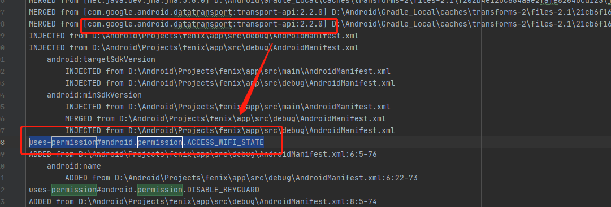
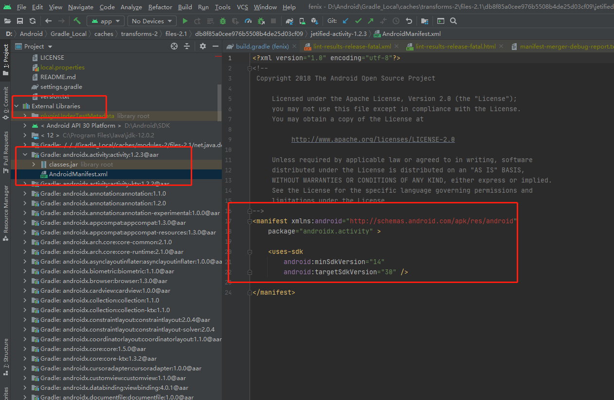
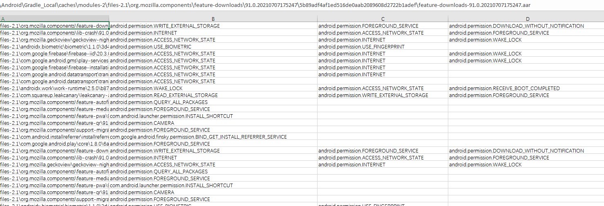
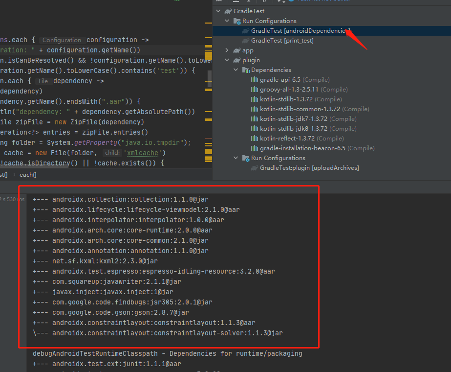
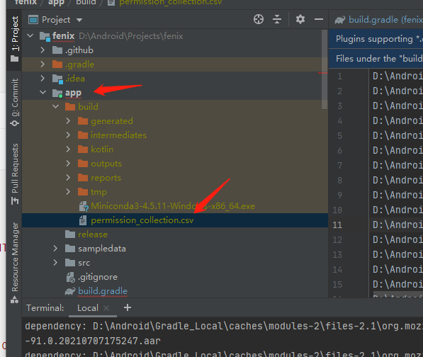

# 扫描依赖权限信息gradle插件原理与使用

为了方便快捷的进行第三方依赖的权限收集，开发了此插件来简化繁琐的手机过程。


## 可能可以使用的方案：

1. 通过查找`app/build/outputs/logs`下面的日志文件

   实际查看时，发现不是很全，还需要自己再去上网查看补充

2. 通过直接在`android studio`下面点开依赖查看

   

   安全人员无法介入开发，只能通过与开发人员沟通获取

3. 使用gradle进行自动扫描

   

   方便快捷，开发人员一次配置后无需其他复杂流程，即可通过命令行产生相关csv文件，简化了权限收集带来的烦恼。

   网上没有相关先例可以参考，`gradle`使用的是`groovy`，开发难度比较大，需要开发将相关`gradle`插件配置到项目中才能进行扫描。

## 使用gradle自动扫描依赖xml文件

### 原理

Android的编译使用的是`gradle`，项目开发中的众多第三方依赖文件都可以通过gradle获取到：



那么可以尝试开发插件来得到第三方依赖文件的文件地址，通过解析文件中的xml文件，读取`uses-permission`信息来获取第三方依赖的权限申请信息。

代码：

```groovy
// 注册一个task
project.task(SAVE_PERMISSIONS) {
            doFirst {
                // 配置权限信息保存地址
                String saveFilePath = project.buildDir.getAbsolutePath() + "/permission_collection.csv"
                println('persmission file save path: ' + saveFilePath)
                BufferedWriter bufferedWriter = new BufferedWriter(new FileWriter(saveFilePath))
                // 获取Android编译配置
                project.extensions.getByName('android').applicationVariants.all { variant ->
                    def name = "${variant.name}CompileClasspath"
                    println(name + " dependencies")
                    Configuration configuration = project.configurations.getByName(name)
                    // 获取到依赖文件
                    configuration.getIncoming().files.each { dependency ->
                        if (dependency.getName().endsWith(".aar")) {
                            println("dependency: " + dependency.getAbsolutePath())
                            // 解析aar文件
                            ZipFile zipFile = new ZipFile(dependency)
                            Enumeration<?> entries = zipFile.entries()
                            String folder = System.getProperty("java.io.tmpdir");
                            File cache = new File(folder, 'xmlcache')
                            if (!cache.isDirectory() || !cache.exists()) {
                                cache.mkdir()
                            }
                            while (entries.hasMoreElements()) {
                                ZipEntry entry = entries.nextElement()
                                // 获取xml文件
                                if (entry.getName().equalsIgnoreCase('AndroidManifest.xml')) {
                                    File xmlFile = new File(cache, entry.getName())
                                    if (xmlFile.exists()) {
                                        xmlFile.delete()
                                    }
                                    InputStream is = zipFile.getInputStream(entry)
                                    FileOutputStream fos = new FileOutputStream(xmlFile)
                                    int len;
                                    byte[] buf = new byte[1024];
                                    while ((len = is.read(buf)) != -1) {
                                        fos.write(buf, 0, len);
                                        buf = new byte[1024]
                                    }
                                    // 关流顺序，先打开的后关闭
                                    fos.close()
                                    is.close()

                                    List<String> permissionList = new ArrayList<>();
                                    DocumentBuilderFactory factory = DocumentBuilderFactory.newInstance()
                                    try {
                                        DocumentBuilder builder = factory.newDocumentBuilder();
                                        Document d = builder.parse(xmlFile);
                                        NodeList manifestNodeList = d.getElementsByTagName("manifest");
                                        for (int i = 0; i < manifestNodeList.getLength(); i++) {
                                            Node sonNode = manifestNodeList.item(i);
                                            NodeList grandSonNodeList = sonNode.getChildNodes();
                                            for (int j = 0; j < grandSonNodeList.getLength(); j++) {
                                                Node grandSonNode = grandSonNodeList.item(j);
                                                if (grandSonNode.getNodeType() == Node.ELEMENT_NODE) {
                                                    // 实际测试中发现，会出现uses-permission-sdk等字段
                                                    if (grandSonNode.getNodeName().toLowerCase().contains("uses-permission")) {
                                                        Element en = (Element) grandSonNode;
                                                        String value = en.getAttribute("android:name");
                                                        permissionList.add(value)
                                                        System.out.println(grandSonNode.getNodeName() + ": " + value);
                                                    }
                                                }
                                            }
                                        }
                                    } catch (Exception e) {
                                        println('error msg: ' + e.getMessage())
                                    }

                                    //写入已经打开的文件
                                    if (permissionList.size() != 0) {
                                        bufferedWriter.write(dependency.getAbsolutePath())
                                        bufferedWriter.write(',')
                                        for (String permission : permissionList) {
                                            bufferedWriter.write(permission)
                                            bufferedWriter.write(',')
                                        }
                                        bufferedWriter.write('\n')
                                    }
                                    xmlFile.delete()
                                }
                            }
                        }
                    }
                }
                bufferedWriter.close()
            }
        }
```

## 使用

1. 解压zip文件到某个地址，这里以`D:\Downloads\repo`为例，修改项目根目录下的`build.gradle`

   

   ```bash
   buildscript {
       repositories {
           ....
           maven{
               url uri('D:/Downloads/repo') # 配置插件地址
           }
           .....
       }
       dependencies {
           ......
           classpath "com.demon.plugin:plugin:1.0.0"
           ......
       }
   }
   ```

2. 修改app下面的`build.gradle`

   ```bash
   apply plugin: 'com.demon.plugin'
   ```

3. `gradle`同步结束后，打开`Android studio`的`Terminal`

   ```bash
   gradlew -q save
   ```

   会在app的build中生成扫描结果

   

## 0709更新

为了简化配置，更新代码与配置

```groovy
# 在项目app的build.gradle末尾添加如下代码，然后编译dubug版app，编译完成后，在app/build下面会产生文件输出
gradle.taskGraph.beforeTask { task ->
    if (task.name.contains('mergeDebugResources')) {
        println('mergeDebugResources info: ' + task)
        if (task != null) {

            if (!project.buildDir.exists()) {
                project.buildDir.mkdir()
            }
            String saveFilePath = project.buildDir.getAbsolutePath() + "/permission_collection.csv"
            println('persmission file save path: ' + saveFilePath)
            BufferedWriter bufferedWriter = new BufferedWriter(new FileWriter(saveFilePath))
            project.extensions.getByName('android').applicationVariants.all { variant ->
                def name = "${variant.name}CompileClasspath"
                println(name + " dependencies")
                org.gradle.api.artifacts.Configuration configuration = project.configurations.getByName(name)
                configuration.getIncoming().files.each { dependency ->
                    if (dependency.getName().endsWith(".aar")) {
                        println("dependency: " + dependency.getAbsolutePath())
                        ZipFile zipFile = new ZipFile(dependency)
                        Enumeration<?> entries = zipFile.entries()
                        String folder = System.getProperty("java.io.tmpdir");
                        File cache = new File(folder, 'xmlcache')
                        if (!cache.isDirectory() || !cache.exists()) {
                            cache.mkdir()
                        }
                        while (entries.hasMoreElements()) {
                            ZipEntry entry = entries.nextElement()
                            if (entry.getName().equalsIgnoreCase('AndroidManifest.xml')) {
                                File xmlFile = new File(cache, entry.getName())
                                if (xmlFile.exists()) {
                                    xmlFile.delete()
                                }
                                InputStream is = zipFile.getInputStream(entry)
                                FileOutputStream fos = new FileOutputStream(xmlFile)
                                int len;
                                byte[] buf = new byte[1024];
                                while ((len = is.read(buf)) != -1) {
                                    fos.write(buf, 0, len);
                                    buf = new byte[1024]
                                }
                                // 关流顺序，先打开的后关闭
                                fos.close()
                                is.close()

                                List<String> permissionList = new ArrayList<>();
                                DocumentBuilderFactory factory = DocumentBuilderFactory.newInstance()
                                try {
                                    DocumentBuilder builder = factory.newDocumentBuilder();
                                    Document d = builder.parse(xmlFile);
                                    NodeList manifestNodeList = d.getElementsByTagName("manifest");
                                    for (int i = 0; i < manifestNodeList.getLength(); i++) {
                                        Node sonNode = manifestNodeList.item(i);
                                        NodeList grandSonNodeList = sonNode.getChildNodes();
                                        for (int j = 0; j < grandSonNodeList.getLength(); j++) {
                                            Node grandSonNode = grandSonNodeList.item(j);
                                            if (grandSonNode.getNodeType() == Node.ELEMENT_NODE) {
                                                if (grandSonNode.getNodeName().toLowerCase().contains("uses-permission")) {
                                                    Element en = (Element) grandSonNode;
                                                    String value = en.getAttribute("android:name");
                                                    permissionList.add(value)
                                                    System.out.println(grandSonNode.getNodeName() + ": " + value);
                                                }
                                            }
                                        }
                                    }
                                } catch (Exception e) {
                                    println('error msg: ' + e.getMessage())
                                }

                                //写入已经打开的文件
                                if (permissionList.size() != 0) {
                                    bufferedWriter.write(dependency.getAbsolutePath())
                                    bufferedWriter.write(',')
                                    for (String permission : permissionList) {
                                        bufferedWriter.write(permission)
                                        bufferedWriter.write(',')
                                    }
                                    bufferedWriter.write('\n')
                                }
                                xmlFile.delete()
                            }
                        }
                    }
                }
            }
            bufferedWriter.close()
        }
    }

}
```


## 参考

> https://www.jianshu.com/p/b1680afc80c7
>
> https://www.jianshu.com/p/bceae568cce6
>
> https://developer.android.com/studio/build/manifest-merge
>
> https://github.com/wequick/Small/tree/master/Android/DevSample/buildSrc
>
> https://blog.csdn.net/xfhy_/article/details/107840592
>
> https://www.jianshu.com/p/b567f0ffec4e
>
> https://github.com/2BAB/Seal/tree/1e1dfa63181eb51c8d424805f3955d4b47cb7b87
>
> https://www.githang.com/gradledoc/userguide/dependency_management.html


